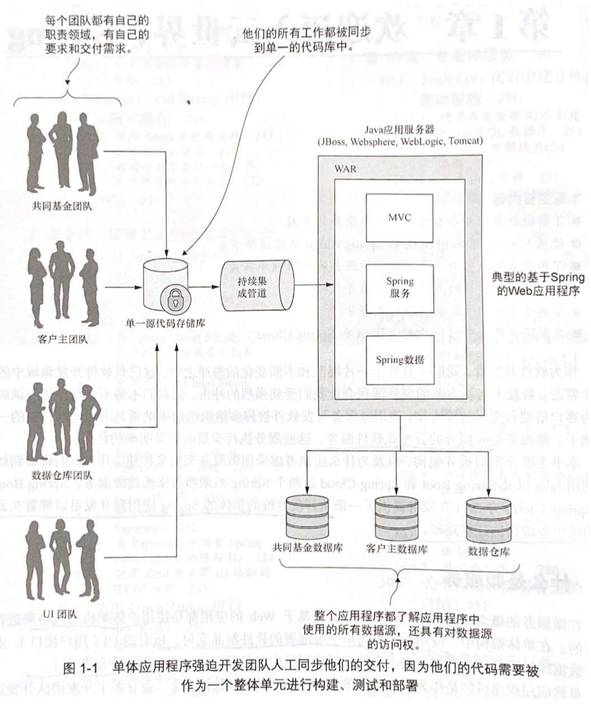
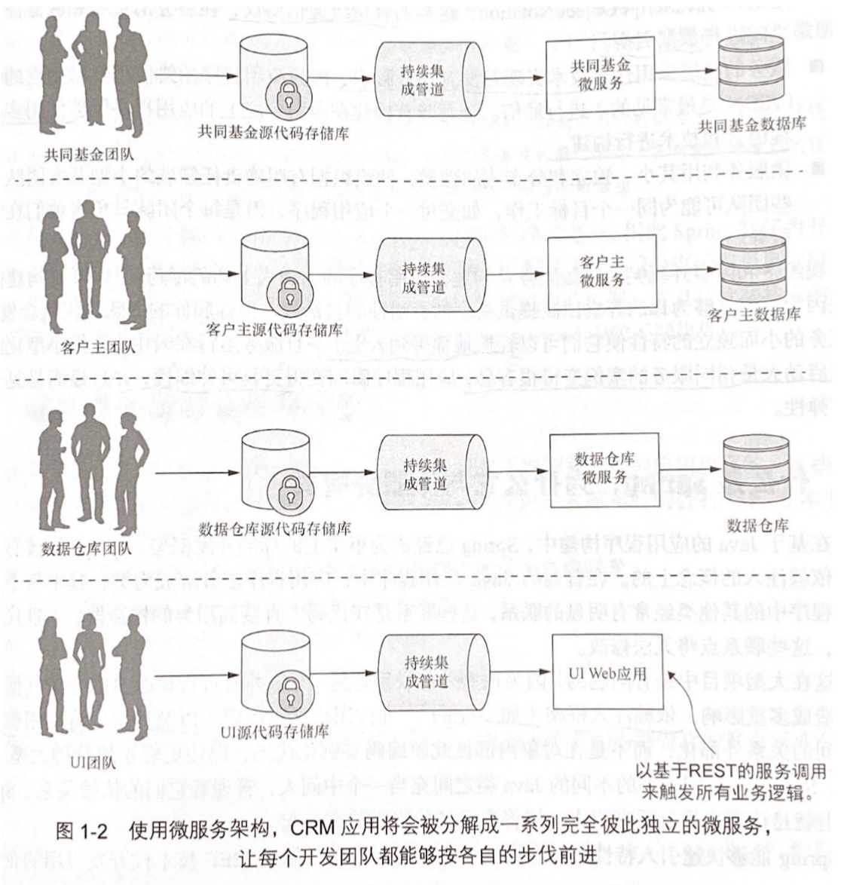

# Chapter 1 - 欢迎迈入云世界，Spring

Created by : Mr Dk.

2020 / 08 / 11 21:27

@Nanjing, Jiangsu, China

---

## 1.1 什么是微服务

在 **微服务** 的概念形成之前，绝大部分基于 Web 的应用都是使用 **单体架构** 的风格构建的。在单体架构中，应用程序作为单个可部署的软件制品交付，所有的 UI、业务、数据库访问逻辑呗打包在一个制品中，部署在一个应用程序服务器上。如果应用中包含多个业务团队，当各个团队需要修改代码时，整个应用程序都要重新构建、重新测试、重新部署：

而微服务是一个 **小的、松耦合的分布式服务**，允许将一个大型应用分解为具有严格职责定义的便于管理的组件。分解和分离应用程序的功能，使它们完全彼此独立。这样，每个功能团队都能完全拥有自己的服务代码和服务基础设施，独立地构建、部署、测试：

微服务架构的特征：

- 应用程序逻辑分解为明确定义了职责范围的细粒度组件
- 每个组件负责独立的职责领域、独立部署
- 微服务之间通过轻量级协议 (如 JSON) 进行数据交换
- 服务底层的技术实现可以是任意的 (因为应用程序使用中立的协议进行通信)
- 分布式，每个团队只负责独立的服务

以下力量正在影响构建应用的方式：

- 应用复杂性上升 (多个数据中心、多个数据库、外部服务)
- 客户期待快速交付 (希望功能能被拆分，可以在短时间内快速发布新功能)
- 性能和可伸缩性 (应用需要跨多个服务器进行扩大，在事务高峰过去后进行收缩)
- 客户希望应用程序可用 (应用程序中的某部分故障不应该导致整个程序的崩溃)

而微服务具有以下特性：

- 灵活性 - 可将解耦的服务进行组合和重新安排
- 有弹性 - 故障可以限制在应用程序的一小部分中 (降级)
- 可伸缩性 - 解耦的服务可以轻松地跨多个服务器进行水平分布

## 1.8 云与微服务？

微服务的服务实例应该迅速启动，服务的每一个实例都是相同的。基于云的微服务的优势是以 **弹性** 的概念为中心。云服务提供商允许开发人员在几分钟之内快速启动新的虚拟机和容器，启动新的服务实例；在服务容量需求下降时，可以关闭虚拟服务器。这样意味着应用程序可以更加弹性。

## 1.9 微服务不只是编写代码

编写健壮的服务需要考虑的问题：

- 正确划分微服务的大小，避免微服务承担太多职责
- 多个服务实例可以快速启动和关闭时，如何管理服务调用的物理细节
- 如何快速绕过失败的服务
- 如何确保每个服务实例之间具有相同的配置和代码库
- 如何最小化服务之间的直接依赖关系，并优雅扩展

### 1.9.1 核心微服务开发模式

- 服务粒度 - 粒度过粗会使服务越来越难以维护，粒度过细会使程序复杂性增加
- 通信协议 - XML / JSON
- 接口设计 - 如何设计实际的服务接口，以进行服务调用
- 服务的配置管理 - 以便在不同云环境之间移动时，不必更改核心代码
- 使用事件解耦微服务

### 1.9.2 微服务路由模式

抽象服务的物理 IP 地址，为服务调用提供单个入口点

- 服务发现 - 客户端在不需要将服务位置硬编码到应用程序的情况下找到它们
- 服务路由 - 为所有的服务提供单个入口点，将统一的安全策略应用到多个服务实例上

### 1.9.3 微服务客户端弹性模式

- 客户端负载均衡 - 将所有请求路由到微服务的健康实例上
- 断路器模式 - 出现故障的微服务调用能够快速失败，以免占用大量系统资源
- 后备模式 - 服务调用失败时，允许客户端尝试通过调用微服务之外的其它方法执行工作
- 舱壁模式 - 使用多个分布式资源来执行工作

### 1.9.4 微服务安全模式

- 验证
- 授权
- 凭据管理和传播

### 1.9.5 微服务日志记录和跟踪模式

微服务架构的缺点在于，调试和跟踪应用程序和服务中发生的事情十分困难。

- 日志关联 - 一个用户事务会调用多个服务，如何将这些服务的日志关联到一起
- 日志聚合 - 将微服务生成的所有日志合并到一个可查询的数据库中
- 微服务跟踪 - 可视化客户端事务

### 1.9.6 微服务构建和部署模式

微服务的每个实例都应该与其它所有实例相同，**配置漂移** 是不允许出现的。

- 构建和部署管道
- 基础设施即代码
- 不可变服务器 (部署之后镜像永远不更改)
- 凤凰服务器 (运行微服务的服务器被定期拆卸，重新创建一个不可变的镜像)
