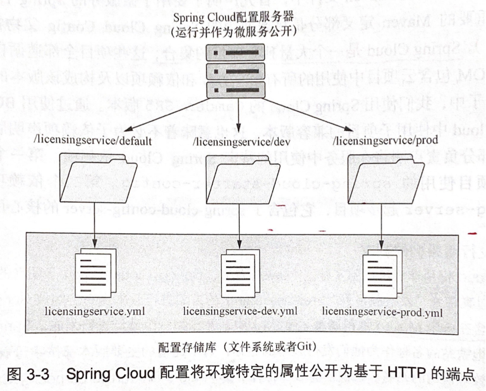

# Chapter 3 - 使用 Spring Cloud 配置服务器控制配置

Created by : Mr Dk.

2020 / 08 / 13 16:50

@Nanjing, Jiangsu, China

---

## 3.1 管理配置的复杂性

通常，会将 **配置信息** 与 **代码** 分开。因此每次对配置进行更改时，应用程序必须重新编译、重新部署。对于配置的管理，需要遵循以下四个原则：

* 分离 - 服务配置与服务部署完全分开
* 抽象 - 将访问配置数据的功能抽象到一个服务接口中，而不是直接为应用编写访问服务存储库的代码
* 集中 - 云上可能会有大量的服务实例，因此最小化保存配置信息的存储库数量很重要
* 稳定 - 由于配置信息与部署服务完全隔离，保证配置信息的高可用、冗余很重要

回忆微服务的生命周期：装配、引导、发现和监控，微服务的配置管理和加载发生在引导阶段。在微服务实例启动引导时，它将调用一个 **服务端点** 来读取其所在环境的配置信息。而配置管理的连接信息 (即服务端点的信息) 将会在微服务启动时被传递给微服务。

## 3.2 构建 Spring Cloud 配置服务器

Spring Cloud 配置服务器也可以被视为是一个微服务实例。这个配置服务的客户端是其它的微服务实例，而配置服务的后端则是配置的具体存储介质，可以是文件系统、版本控制库或数据库。

根据配置服务扮演的角色，很显然，在启动一个配置服务时，需要将一些信息作为参数启动服务。这些配置信息位于 `xxx/src/main/resources` 目录下的 `application.yml` 中。其中包含的信息包括：

1. Spring Cloud 配置服务器将要监听的端口号
2. 配置存储的后端的类型 (文件系统 / 数据库 / Git 版本控制库)
3. 配置存储的路径 (文件路径 / 数据库连接信息 / Git 版本控制库的连接信息)

在每个应用的配置存储路径下，还可以提供适用 **不同环境** 的配置文件：默认环境、开发环境等。应用程序配置文件的命名约定为：`应用程序名称-环境名称.yml`。



配置服务需要作为一个服务实例被启动。因此，每一个 Spring Cloud 服务也需要一个启动引导类。在引导类上，需要加入 `@SpringBootApplication` (表明这也是一个 Spring Boot 应用程序) 以及 `@EnableConfigServer` (成为 Spring Cloud Config 服务) 注解。然后就可以启动配置服务器了。

在配置服务启动后，如果其它服务实例想要检索 `a` 应用的开发环境配置，那么直接向配置服务运行的端口发送对 `/a/dev` 的 GET 请求即可。在访问开发环境的配置时，配置服务器将会返回默认配置属性和开发环境的配置属性。这是因为 Spring 框架实现了一种层次解析机制 - 始终首先查找默认属性，然后用特定环境 (如开发环境) 的配置值覆盖默认配置值。

## 3.3 将 Spring Cloud Config 与 Spring Boot 客户端集成

当其它服务实例启动时，需要通过命令向服务实例传递三个信息：

1. 服务的应用程序名称
2. 应用程序的运行环境 profile
3. 连接到 Spring Cloud Config 服务器的连接信息

比如，对一个名为 `a` 的应用来说，想要以开发环境启动，上述信息已经足够实例在启动时访问配置服务器 `<cloud_config_url>/a/dev` 获取 `a` 的开发环境配置。这些信息被配置在服务实例源码目录 `src/main/resources/` 的 `bootstrap.yml` 或 `application.yml` 中。

在启动服务实例时，如果不加任何参数，那么实例将直接使用 `bootstrap.yml` 或 `application.yml` 中定义的配置启动。也可以将服务编译为一个 JAR，然后在 JAR 启动时加入 `-D` 系统属性 **覆盖** 之前定义的配置。

Spring Boot Actuator 可以增强服务的自我检查能力。如果访问服务的 `/env` end point，可以获得服务实例的配置信息完整列表，包括服务启动的环境和 end point。

通过使用 `@Value` 注解，服务可以直接从 Spring Cloud 配置服务器中提取配置属性并注入应用程序的类中。

当 Spring Cloud 后端管理的配置发生变化时，如何动态刷新正在运行的所有服务实例？由于 Spring Boot 服务实例只会在启动时读取配置，因此 Spring Cloud 管理的配置发生更改时并不会被 Spring Boot 实例自动获取。Spring Boot Actuator 提供了一个 `@RefreshScope` 注解，暴露了 Spring Boot 实例的 `/refresh` end point。访问实例的 `/refresh` end point 将会强制 Spring Boot 实例重新读取应用程序的配置。

> 刷新微服务的手段
>
> Spring Cloud 服务提供了一种 *Spring Cloud Bus* 的推送机制，使 Spring Cloud 配置服务器能够向所有使用配置服务的实例发布有更改发生的消息。但是并不是所有的 Spring Cloud 后端都支持这个功能。
>
> 或许，可以写一个简单的脚本查询服务发现引擎，查找所有的服务实例，然后直接调用所有实例的 `/refresh` end point 即可。
>
> 还有一种方法是直接重启服务器或容器，来接收新属性。重启 docker 容器的时间非常短。

## 3.4 保护敏感的访问信息

默认情况下，Spring Cloud 配置服务的后端存储以 **明文** 形式存放所有的配置属性，包括数据库凭据等敏感信息。出于安全考虑，将敏感信息以密文的形式存储在配置文件中更安全。这就需要使用加密与解密。对称加密与非对称加密都是支持的，只需要提前将密钥设置在 Spring Cloud 配置服务或其它所有服务实例所运行的服务器上的环境变量中即可。

在 Spring Cloud 配置服务实例启动后，将会检测环境变量 `ENCRYPT_KEY` 并暴露 `/encrypt` 和 `/decrypt` end point。用户可以通过向这两个 end point 发送 POST 请求，附带明文或密文，实现加密或解密。

Spring Cloud 规定，在后端的配置文件中，被加密的属性值前需要加上 `{cipher}`：

```c
spring.datasource.password:"{cipher}84583464835248fe"
```

由此，Spring Cloud 配置服务器在读取到配置后，会识别出这是一个被加密的配置属性。默认情况下，配置服务器将自行解密已被加密的配置。那么当其它服务实例访问配置服务器时，被解密的敏感信息又会被以明文的形式传递。因此，这里的要点是，不要让配置服务器自行解密配置属性，而是直接将密文配置发送给客户端，由客户端的服务实例自行解密。这样，敏感数据将不会以明文形式传递。满足这个功能需要以下三个条件：

1. 配置 Spring Cloud 配置服务器不要解密属性
2. 在客户端服务实例所在服务器上设置解密密钥
3. 客户端服务实例需要有密码库的支持

为满足第一个条件，需要在配置服务器的 `application.yml` 中设置 `spring.cloud.config.server.encrypt.enabled` 为 `false`。客户端服务实例需要在 Maven 中引入 `spring-security-rsa` 依赖，以支持在客户端解密配置属性。

---

