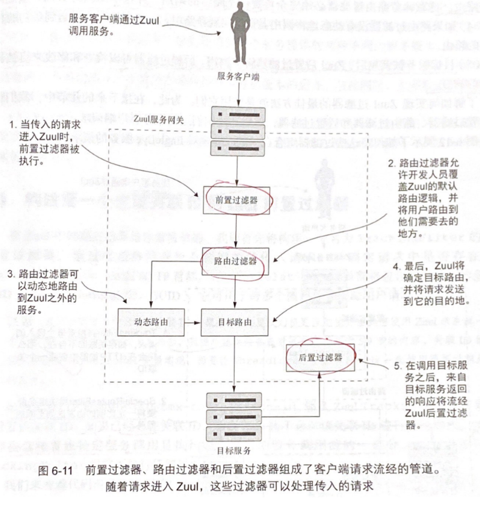

# Chapter 6 - 使用 Spring Cloud 和 Zuul 进行服务路由

Created by : Mr Dk.

2020 / 08 / 17 21:48

@Nanjing, Jiangsu, China

---

## 6.1 什么是服务网关

在微服务这种分布式架构中，如果要进行安全行为、日志记录行为、用户跟踪行为正常运行，开发人员需要在所有服务中全都实现这些功能。这么做会有一些问题：

1. 在每个服务中都实现这一套流程很难
2. 将实现 _横切关注点_ 的任务推给各个服务的开发团队，将很难保证这些功能被正确实现
3. 所有服务中都会多出一个顽固的依赖

如果能将这些 _横切关注点_ 抽象为一个独立的服务，作为所有微服务调用的过滤器、路由器，就能够解决问题。这个服务被称为 **服务网关 (Service Gateway)**。服务的客户端不再直接调用服务 - 服务网关作为 **单个策略执行点 (Policy Enforcement Point, PEP)**，所有服务调用都通过服务网关进行路由，最终被路由到目标服务。在服务网关中集中实现的横切服务关注点有如下几个：

- 静态路由 - 开发人员只需要知道服务网关的 URL 就够了
- 动态路由 - 服务网关可以对传入的请求进行智能路由
- 验证和授权 - 所有服务调用都经过服务网关进行路由，这样天然就适合验证和授权
- 数据收集和日志记录

如果没有服务网关，那么客户端直接通过不同的端点访问每个服务；而服务网关使得客户端可以仅与服务网关管理的单个 URL 进行对话，客户端不再访问单个服务的 URL。服务网关从 URL 中分离出要调用的服务，然后将服务调用请求向目标服务路由。服务网关充当所有微服务调用入站流量的守门人。

> 为了避免服务网关成为潜在瓶颈，服务网关应当被正确实现。
>
> 1. 负载均衡器应该挡在服务网关前面，这样服务网关可以伸缩
> 2. 服务网关应当是无状态的，否则将限制服务网关的可伸缩性
> 3. 服务网关应当足够轻量

## 6.2 Spring Cloud 和 Netflix Zuul 简介

Zuul 是 Netflix 的开源服务网关实现，提供了如下的功能：

- 路由器 - 将所有服务的路由映射到一个 URL (单一入口点)，或某几个 URL
- 过滤器 - 构建可以对通过网关的请求进行检查和操作的过滤器

要使用 Zuul，需要在 Maven 中引入依赖，然后再 Zuul 服务的引导类中添加 `@EnableZuulProxy` 注解。Zuul 默认为设计在 Spring 上的产品工作，所以会自动使用 Eureka 来查找服务，并使用 Ribbon 实现客户端负载均衡。因此，需要在 Zuul 服务器的 `application.yml` 中指明 Eureka 服务器的位置。配置方式与服务发现、服务注册的方式相同。

## 6.3 在 Zuul 中配置路由

Zuul 的核心是一个反向代理 (参考 Nginx)，负责捕获客户端的请求，然后代表客户端调用远程资源 (服务)。因此，Zuul 必须知道如何将客户端请求映射到远程的服务上。Zuul 有三种机制可以做到这一点：

- 通过服务发现自动映射路由
- 通过服务发现手动映射路由
- 使用静态 URL 手动映射路由

### 6.3.1 通过服务发现自动映射路由

Zuul 默认将自动使用被调用服务在 Eureka 服务中注册的服务 ID。假设 Zuul 服务正在 `localhost:5555` 上运行，则直接通过调用 `localhost:5555/organizationservice`，使用服务端点路径中的第一部分表示想要调用的服务。然后 Zuul 通过这个服务 ID (`organizationservice`) 自动路由请求。

使用 Zuul + Eureka 的好处在于，开发人员有了单独的调用 end point。另外，开发人员可以添加和删除服务实例，而无需修改 Zuul。因为 Zuul 自动与负责服务注册与发现的 Eureka 通信。对 Zuul 服务的 `/routes` 进行访问，可以返回服务中所有的映射路由。

### 6.3.2 使用服务发现手动映射路由

开发人员可以在 Zuul 的 `application.yml` 中手动定义路由映射规则：

```yaml
zuul:
  ignored-services: "organizationservice"
  prefix: /api
  routes:
    organizationservice: /organization/**
```

这样，路由名称将会被简化为 `locahost:5555/organization`。此时访问 `/routes` 将会出现自动映射与手动映射的两个条目。如果想要排除 Eureka 服务 ID 路由的自动映射，在配置文件中需要加入额外的参数 `ignored-services` 把服务 ID 对应的自动映射路由给排除。如果要排除所有的自动映射路由，该属性可以被设置为 `*`。

Zuul 还可以在配置中使用 `prefix` 来支持 URL 中的前缀 - `locahost:5555/api/organization`。

> 这里我理解相当于给服务发现代理中的服务 ID 取别名？

### 6.3.3 使用静态 URL 手动映射路由

用于路由不受 Eureka 管理的服务。如果没有服务发现代理，那么显然需要将一个 URL path 映射到某个服务的具体位置上去。配置方式显而易见：

```yaml
zuul:
  routes:
    licensestatic:
      path: /licensestatic/**
      url: http://licenseservice-static:8081
```

这里为了配置 Zuul 能够映射多个服务实例，并通过 Ribbon 进行负载均衡。首先需要禁用 Ribbon 与 Eureka 的集成，然后可以这样配置：

```yaml
zuul:
  routes:
    licensestatic:
      path: /licensestatic/**
      serviceId: licensestatic
ribbon:
  eureka:
    enabled: false
licensestatic:
  ribbon:
    listOfServers: http://service:8081, http://service:8082
```

禁用 Ribbon 与 Eureka 的集成可能会带来一些问题 - 比如客户端缓存无法使用，每次服务请求都将会调用 Eureka 进行服务查找。

### 6.3.4 动态重新加载路由配置

使用 Spring Cloud Config 来管理 Zuul 的配置，外部化 Zuul 的路由。Zuul 也公开了基于 POST 的 end point `/refresh`，用于动态重新加载配置。

### 6.3.5 Zuul 和服务超时

Zuul 使用 Netflix 的 Hystrix 和 Ribbon 库，防止长时间运行的服务调用影响网关的性能。默认超过 1s 的服务调用将会被 Zuul 终止，并返回 HTTP 500 错误。Zuul 的配置文件中可以覆盖默认的配置。通过 Zuul 的所有服务默认使用 `hystrix.command.default.execution.isolation.thread.timeoutInMilliseconds` 作为超时时间。另外，可以单独为每个服务覆盖超时时间 - `hystrix.command.<serviceid>.execution.isolation.thread.timeoutInMilliseconds`。

另外注意还有 Ribbon 的 `<serviceid>.ribbon.ReadTimeout` 超时属性。

---

## 6.4 Zuul 的真正威力：过滤器

之前的功能主要描述 Zuul 的路由功能。而 Zuul 的过滤器功能使得开发人员可以为所有服务强制执行一组一致的应用程序策略，比如认证授权、日志记录、服务跟踪等。这些策略被认为是所谓的 _横切关注点_，因为开发人员希望它们应用于所有服务，无需每个服务单独实现。Zuul 支持三种类型的过滤器，用于拦截请求：

- 前置过滤器 - 在 Zuul 受理请求后被调用，主要负责鉴权、消息格式检查等
- 后置过滤器 - 在目标服务被调用，将响应发送回客户端前被调用，可以负责日志记录
- 路由过滤器 - 在调用目标服务之前被调用，可以动态选择路由目标



简单的工作过程如下：

1. 请求进入 Zuul 网关时，Zuul 调用所有前置过滤器，前置过滤器可以对 HTTP 请求进行检查和修改
2. Zuul 执行已定义的路由过滤器，可以更改请求指向的目的地
3. 路由过滤器可以将请求重定向到其它位置 - 但并不是重定向，而是 Zuul 终止当前 HTTP 请求后，完全负责代表原始调用者调用相应服务
4. 目标服务被调用后，Zuul 的后置过滤器被调用，用于检查和修改来自被调用的服务相应

> 关于路由过滤器的使用场景，书中给出的例子：
>
> 某个服务的新版本有了一些新的特性，我们想要让少量用户能够使用到这些新特性。目前，已经分别启动了若干旧版本和新版本的服务实例。通过路由过滤器，可以将少量的请求路由到新版本的服务实例上，将大部分的请求路由到旧版本的服务实例上。

## 6.5 构建第一个生成关联 ID 的 Zuul 前置过滤器

构建一个前置过滤器，检查所有传入网关的请求中，是否存在 `tmx-correlation-id` 的 HTTP 头部。如果没有，那么生成一个头部并塞到 HTTP 请求中。

所有的 Zuul 过滤器必须继承自 `ZuulFilter` 类，然后重写四个函数：

- `String filterType()` - 返回过滤器的类型
- `int filterOrder()` - 返回过滤器的执行顺序
- `boolean shouldFilter()` - 指示这个过滤器是否要被执行
- `Object run()` - 服务通过过滤器时要执行的业务逻辑

后置过滤器和路由过滤器也是类似。
