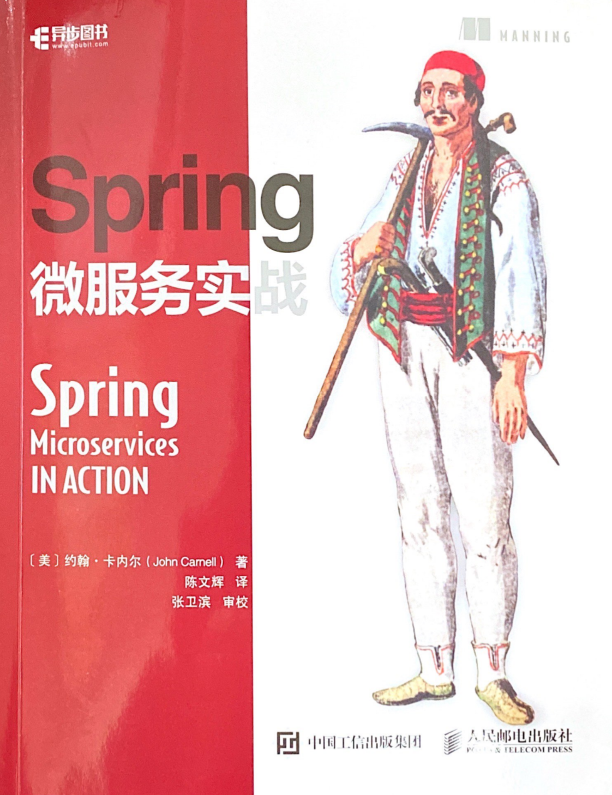

# spring-microservices-notes

☁️ Notes of reading _Spring microservices in action_.

Created by : Mr Dk.

2020 / 08 / 08 @Nanjing, P.R.China

---

## About

The notes of reading _Spring microservices in action_ by _John Carnell_, translated by _陈文辉_。The cover of the book is as follows, **please support the legal edition!**

---

## License

Copyright © 2020, Jingtang Zhang. ([MIT License](./LICENSE))
